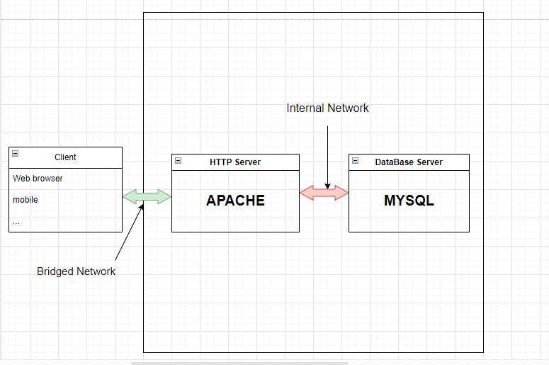

# Distributed MVC Architecture

Distributed MVC (Model-View-Controller) architecture is a software design pattern that divides an application into three interconnected components: the Model, the View, and the Controller. The architecture is designed to be distributed across multiple servers, allowing for improved scalability and fault tolerance.

## Task
  my objective is to build such architecture using VirtualBox by creating several virtual machines; one for the [HTTP server](https://fr.wikipedia.org/wiki/Serveur_web) and another for the database server.
## Architecture
  